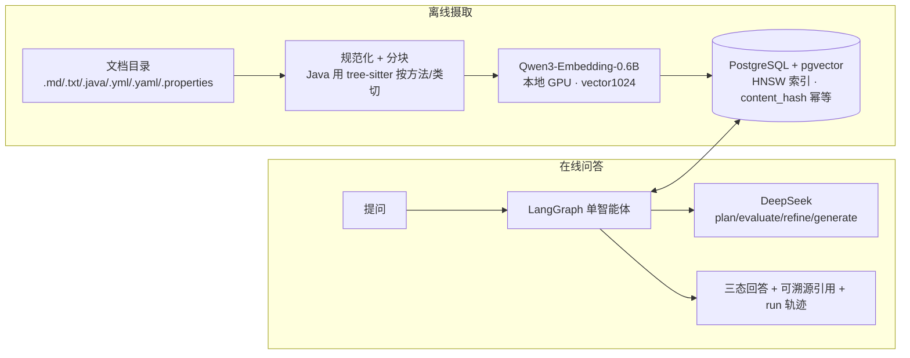
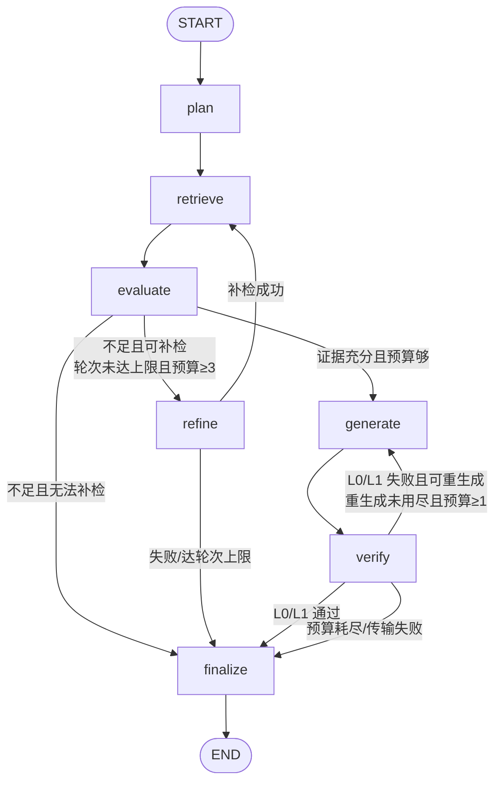

# devkb — Agentic RAG 软件项目知识助手（P1）

把一个软件项目的**文档 + Java 源码 + 配置**摄取为向量知识库，用一个 **LangGraph 单智能体**回答问题：自主规划检索 → 判断证据是否充分 → 不足则补检一次 → 生成 → 逐条校验引用 → 三态收尾（**完整 / 部分 / 拒答**）。**每个回答都附可溯源的真实引用（文件路径 + 行号 + 标题路径），并对每条论断做引用编号与逐字引文校验**。

当前阶段 **P1 Agentic RAG MVP**（已过 dev §5.2 六项硬 Gate）。P0 固定单管道对照路径仍保留（`--pipeline fixed-rag`）。阶段边界见 `docs/范围冻结与架构决策.md`。

- **技术栈**：Python 3.12 + uv ｜ PostgreSQL 16 + pgvector（单库多职责，HNSW 索引）｜ SQLAlchemy(async) + Alembic ｜ Qwen3-Embedding-0.6B（本地 GPU，ADR-0002，`vector(1024)`）｜ DeepSeek（唯一在线 LLM 供应商，OpenAI 兼容端点，ADR-0004）｜ LangGraph ｜ FastAPI ｜ Typer + Rich
- **实测规模**：mini-mall-order 语料 **445 文档 → 4788 chunks**（Markdown + Java + 配置）；单问在线路径每 run 发往 DeepSeek 的请求 **硬上限 6 次**、检索 **硬上限 2 轮**。
- **Agentic ≠ Multi-Agent**：这是**一个** agent、一张确定性状态图。所有分支（补检 / 生成 / 重生成 / 拒答）都由**确定性代码**依据结构化信号和预算判定，LLM 只在 plan/evaluate/refine/generate 四处被调用、且**不能返回控制流**。没有多智能体、没有 agent 间对话。

## 架构



**LangGraph 状态图**（节点确定性编排，条件边只读结构化状态与预算）：



- **plan**：把问题拆成 ≤3 条检索子查询。
- **retrieve**：在线默认 **vector-HNSW 多查询检索**（`ef_search=40`；各子查询的 HNSW 命中用 RRF 融合去重后取前若干条为证据）。
- **evaluate**：判定证据 `sufficient / partial / insufficient` 并列出缺失方面；空证据由确定性代码强制走补检或拒答，**不生成零证据回答**。
- **refine**：至多补检一轮，改写查询后回到 retrieve。
- **generate**：生成带 `[E#]` 引用的结构化 claims（answer_text + claims + not_found + limitations）。
- **verify**：**L0**=每个 `[E#]` 都指向本次证据（越界剔除并记 warning）；**L1**=每条 quote 逐字命中其绑定证据；失败最多重生成一次。
- **finalize**：只读结构化状态、不再调 LLM，输出三态。

## 三态回答策略

| mode | 触发条件（确定性） | 含义 |
|---|---|---|
| **full** | evaluate=sufficient **且** 有通过验证的 claim **且** 无 not_found 未覆盖项 **且** L0/L1 通过 | 证据充分、引用全部过校验 |
| **partial** | 有证据但未达 full（有 not_found、或部分 claim 因验证失败被移除） | 只答证据支持的部分，缺口写入 not_found/limitations |
| **refusal** | 无可用证据、或全部 claim 未通过验证被移除 | 「现有资料不足以回答」，列出缺什么，**不编造** |

> 设计取舍：`finalize` 只在 `not not_found` 时才判 full，是**保守**设计——宁可标 partial，也不把带未覆盖方面的回答夸大为完整。误拒是严格验证的代价，不是缺陷。

## 起步

```bash
cp .env.example .env         # 填入 DEVKB_LLM_API_KEY（DeepSeek）
make up                      # 启动 postgres（pgvector 镜像）
uv run alembic upgrade head  # 建表 + HNSW 索引（vector(1024)，ADR-0002 冻结维度）

# 摄取：支持 .md/.txt/.java/.yml/.yaml/.properties，单文件 ≤5MB，跳过隐藏目录（需要 GPU，见下）
uv run devkb ingest <你的项目目录> --project demo

# 提问（默认 agentic 链路）
uv run devkb ask "取消订单时库存释放会不会被重复执行？" --project demo
uv run devkb ask "..." --project demo --json          # 完整 Answer JSON（mode/claims/引用/warnings/usage）
uv run devkb ask "..." --project demo --pipeline fixed-rag   # P0 固定单管道对照

# 历史 run（可回放的完整轨迹）
uv run devkb runs list --project demo
uv run devkb runs show <run_id> --project demo        # Answer + 步骤 + 工具调用
uv run devkb runs replay <run_id> --project demo
```

- **网络提示（WSL/代理环境实测，缺一挂死）**：真实模型调用必须同时 ① **unset 全部代理环境变量**（本地 SOCKS/HTTP 代理会干扰 httpx 直连 DeepSeek）② 加 **`HF_HUB_OFFLINE=1`**（直连时 huggingface.co 遭 DNS 污染会 SYN-SENT 静默挂死；嵌入模型首次下载后即走本地缓存）。
- 嵌入模型要求宿主 GPU（ADR-0002：本模型 CPU 批量编码不可用；fp16 + batch≤32 为 8GB 显存实测约束）。

## 本地 HTTP API

```bash
uv run devkb serve                    # 默认只监听 127.0.0.1:8000
curl localhost:8000/healthz           # 进程/数据库/迁移版本探测（不加载模型）
curl -X POST localhost:8000/ask -H 'content-type: application/json' \
  -d '{"project":"demo","question":"取消订单时库存释放会不会被重复执行？"}'
curl "localhost:8000/runs/<run_id>?project=demo"   # run + steps + 工具调用 + Answer
```

> **⚠️ 安全边界：P1 API 完全无鉴权，仅限本机使用，严禁绑定非回环地址或经端口转发/反代暴露公网。** 任何能访问该端口的人都可读取知识库内容与全部历史 run。按范围冻结决策，P1 不加入 JWT/CORS/管理后台。此外：`.env` 不入库、API key 只经环境变量、日志不打印文档正文与 secret、解析器永不执行被解析内容。

## 检索模式与「为什么在线只用向量」

摄取后可用四种可评测检索通道：`vector-exact`（精确扫描，召回基线）、`vector-hnsw`（近似，在线默认）、`lexical`（PostgreSQL 全文检索）、`hybrid-rrf`（向量 + lexical 用 RRF 融合，k=60）。

**在线 `ask`/`serve` 路径固定用 vector-HNSW 多查询，不启用 Hybrid lexical 通道**。原因是如实记录的负结果：在本语料上 Hybrid 的 Recall@10 **未跑赢**纯向量、MRR 反而下降（T15.4，`docs/Evaluation-v1.md` §7 与 dev 报告均留档）——lexical 通道被 camel 命名拆出的高频子词稀释。Hybrid 作为完整对照通道保留在评测里，是否上线待 P2 检索改进后重议（见 `docs/backlog.md`）。

## 评测

```bash
make eval-ci                                         # 评测层单测（FakeEmbedder/FakeLLM，不触网）
uv run devkb eval run --split dev --mode all --project mini-mall   # 真实模型 dev 全量（报告落盘，不覆盖历史）
```

- dev §5.2 六项硬 Gate（正确拒答、误拒 ≤1/17、最终 L0/L1=100%、预算内、终态完整、检索 overlap）已全过；citation-to-anchor proxy 按**记录义务**落盘（当前 52.9%，逐题归因见报告），硬性兜底由 **U2.2 人工引用抽查**承担（`evalsets/reports/p1-manual-check.md`，14/14=100%）。
- **holdout 只运行一次**，须先通过冻结核对与用户授权（`benchmarks/p1_freeze_check.py`）。评测数据纪律见 `docs/Evaluation-v1.md`。

## 已知限制（P1 如实声明）

1. **引用保证可溯源，不保证回答为真**：L0 校验引用编号指向本次证据，L1 校验引文逐字命中绑定证据；**均不校验语义支持度**（L2 语义支持度离线评测是 P2）。
2. **partial 偏保守**：generate 偶尔把 Schema 示例的 `not_found` 占位当内容抄，个别本可 full 的回答被降级为 partial（已诊断、记 `docs/backlog.md`；修它属 Prompt 变更会使冻结失效，P1 保持现状）。
3. **检索天花板**：445 文件语料上部分精确标识符类问题在 top-10 内也无命中；proxy < 冻结阈值主要由此而非引用错误导致（逐题归因见 dev 报告）。
4. **单用户单机**：无鉴权（安全边界见上文）、无增量索引（文档变更靠 content_hash 全文档重嵌）。
5. **摄取范围**：.md/.txt/.java/.yml/.yaml/.properties，单文件 ≤5MB；其他语言解析、PDF 等不在 P1 范围。

## 开发

```bash
make ci    # ruff + pyright + pytest（全部测试用 FakeEmbedder/FakeLLM，不触网、不调真实模型）
make lint  # ruff format --check + ruff check（只检查不改动；make fmt 才写回）
make test  # pytest
```

数据隔离：所有 SQLAlchemy 查询构造只在 `src/devkb/repositories.py`，Repository 以 project_id 实例化、查询方法不接受外部传入的 project_id（D7）。文档地图与硬规则见 `CLAUDE.md`。
