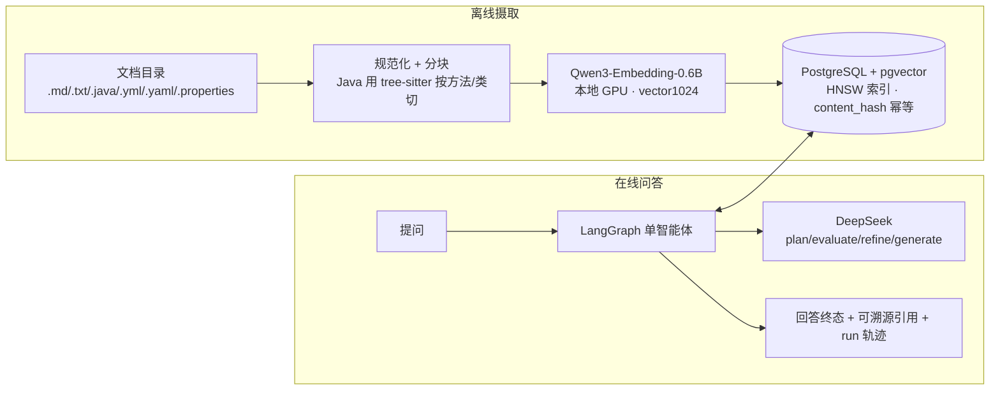
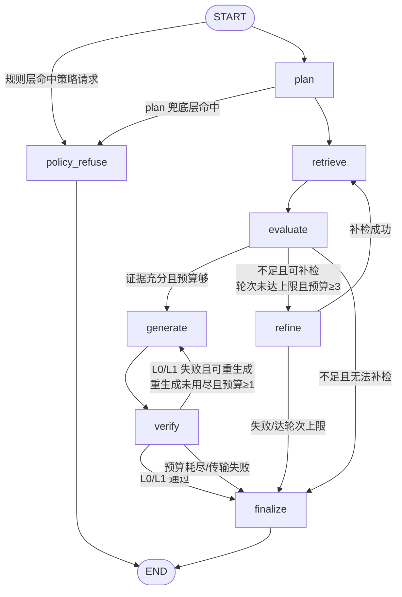

# devkb — Agentic RAG 软件项目知识助手（P1.5）

把一个软件项目的**文档 + Java 源码 + 配置**摄取为向量知识库，用一个 **LangGraph 单智能体**回答问题：自主规划检索 → 判断证据是否充分 → 不足则补检一次 → 生成 → 逐条校验引用 → 三态收尾（**完整 / 部分 / 拒答**），策略类请求另走独立的第四终态 **policy_refusal**。**完整/部分回答里的每条事实性论断都附可溯源的真实引用（文件路径 + 行号 + 标题路径），并做引用编号（L0）与逐字引文（L1）校验；拒答（证据不足）不产出引用，只说明缺什么**。

当前阶段 **P1.5 可靠性 / 诚实加固**（ADR-0010）。P1.5 在 P1 基线上加的**不是**新能力，而是**回答契约的诚实与一致**：`not_found` 四分类、policy-refusal 独立终态、静态摄取覆盖披露、能力边界诚实声明，以及一套分环节、不加总的契约评测。**P1.5 的 dev Gate 未通过，以此状态收尾冻结——详见「评测」一节。这是如实记录。** P0 固定单管道对照路径仍保留（`--pipeline fixed-rag`）。阶段边界见 `docs/范围冻结与架构决策.md`。

- **技术栈**：Python 3.12 + uv ｜ PostgreSQL 16 + pgvector（单库多职责，HNSW 索引）｜ SQLAlchemy(async) + Alembic ｜ Qwen3-Embedding-0.6B（本地 GPU，ADR-0002，`vector(1024)`）｜ DeepSeek（唯一在线 LLM 供应商，OpenAI 兼容端点，ADR-0004）｜ LangGraph ｜ FastAPI ｜ Typer + Rich
- **实测规模**：mini-mall-order 语料 **445 文档 → 4788 chunks**（Markdown + Java + 配置）；单问在线路径每 run 发往 DeepSeek 的请求 **硬上限 6 次**、检索 **硬上限 2 轮**。P1.5 的契约评测**换到另一个陌生仓库**跑（`rag-kb-p1-20260722`，183 文档 / 1424 chunks）——开发语料上的表现不算数，这是有意的泛化检验。
- **Agentic ≠ Multi-Agent**：这是**一个** agent、一张确定性状态图。所有分支（补检 / 生成 / 重生成 / 拒答 / 策略拒答）都由**确定性代码**依据结构化信号和预算判定，LLM 只在 plan/evaluate/refine/generate 四处被调用、且**不能返回控制流**。没有多智能体、没有 agent 间对话，**也没有动态工具调用**——在线唯一的工具是只读 retrieve，有界 function-calling 子循环属 P1.6。

## 架构



**LangGraph 状态图**（节点确定性编排，条件边只读结构化状态与预算）：



- **plan**：把问题拆成 ≤3 条检索子查询。
- **retrieve**：在线默认 **vector-HNSW 多查询检索**（`ef_search=40`；各子查询的 HNSW 命中用 RRF 融合去重后取前若干条为证据）。
- **evaluate**：判定证据 `sufficient / partial / insufficient` 并列出缺失方面；空证据由确定性代码强制走补检或拒答，**不生成零证据回答**。
- **refine**：至多补检一轮，改写查询后回到 retrieve。
- **generate**：生成带 `[E#]` 引用的结构化 claims（answer_text + claims + not_found + limitations）。
- **verify**：**L0**=每个 `[E#]` 都指向本次证据（越界剔除并记 warning）；**L1**=每条 quote 逐字命中其绑定证据；失败最多重生成一次。
- **finalize**：只读结构化状态、不再调 LLM，输出三态；并做一层**只降不升**的确定性兜底（见下）。
- **policy_refuse**：策略类请求的独立终态。判定在图外由确定性规则完成、短路点在第一个供应商调用之前，因此「命中即零 LLM 调用、零检索、零工具」是**拓扑事实**而不是约定。

## 回答终态：三态 + 独立的 policy_refusal

| mode | 触发条件（确定性） | 含义 |
|---|---|---|
| **full** | evaluate=sufficient **且** 有通过验证的 claim **且** 无 not_found 未覆盖项 **且** L0/L1 通过 **且** 正文未命中否定标记 | 证据充分、引用全部过校验 |
| **partial** | 有证据但未达 full（有 not_found、部分 claim 因验证失败被移除、或被下述规则降级） | 只答证据支持的部分，缺口写入 not_found/limitations |
| **refusal** | 无可用证据、或全部 claim 未通过验证被移除 | 「现有资料不足以回答」，列出缺什么，**不编造** |
| **policy_refusal** | 问题在图外命中策略规则（受保护对象 ∧ 索取祈使，或越权命令执行单因子） | 固定策略边界，**零检索零生成零工具**；受保护对象不写入 not_found |

`finalize` 的兜底是**只降不升**（`min(...)` 结构性保证），三条降级规则：`full` 带未覆盖缺口 → partial；`full` 无结构化 claim → partial；**`full` 正文命中封闭否定标记表 → partial 并附能力边界声明**。

> 设计取舍：宁可标 partial，也不把带未覆盖方面的回答夸大为完整。误拒是严格验证的代价，不是缺陷。第三条规则同理——封闭词表匹配**不是语义判定**，它只用来**否决 full**：误报的代价仅是「本可 full 的题变 partial」，不产生任何虚假断言；漏报（措辞全在表外）是**已知的 fail-open**，有测试冻结、见「已知限制」。

## 诚实性口径：not_found 四分类、覆盖披露、能力边界声明

**`not_found` 四分类**（确定性代码判定，零 LLM 调用；一条缺口只能有一个原因）：

| 类别 | 判定依据 | P1.5 是否产出 |
|---|---|---|
| `missing_from_current_evidence` | 本次检索证据不足以覆盖该方面 | ✅ |
| `unsupported_or_not_ingested` | 摄取后缀集 + documents 表 + 有限技术词→后缀映射；措辞一律条件式 | ✅ |
| `confirmed_undocumented` | 需要仓库级 inventory 才能证明「全局不存在」 | ❌ **永不产出**（属 P1.6，有单测锁定）；P1.5 一律降级为「当前证据不足以穷举确认」 |
| `forbidden_or_unavailable_by_policy` | 策略边界 | ❌ **无明细项输出**——枚举齐备但无代码产出，其语义由 `mode=policy_refusal` 这个终态本身承载；命中时受保护对象**不写入** not_found（`final_not_found == []` 是结构性事实，非措辞约束） |

> ⚠️ **分类是确定性的，但每条 `not_found` 里点到的类名/路径不是。** `refs` 由确定性代码从**模型自己写的缺口句子**抽路径 token 再与索引比对，该比对**只判文件身份、不判命题**——所以既可能绑到错误的文件，也可能出现仓库里根本不存在的类名。2026-08-09 人工复核实测到三个编造类名与一处绑错。详见「已知限制」第 3 条。

**静态摄取覆盖披露**：`refusal` / `partial` 正文**无条件**附一段固定文案，把「这个格式没被摄取」与「仓库确实没有这类源码」在用户端分开：

> （本项目摄取范围：自动摄取管线只处理 .java、.md、.properties、.txt、.yaml、.yml；.css、.html、.js、.py、.sql、.ts、.tsx、.vue 等其他类型不在自动摄取范围内。此类文件若未出现在证据中，可能只是未被摄取，不足以据此确认仓库是否包含此类文件。）

无条件附加是刻意的：条件触发会退化成逐题语言/意图推断（属 P1.6）。该文案零参数零 I/O，**说不出**「本项目索引里有没有 X」。

**能力边界诚实声明**：全局否定 / 穷举类问题（「有没有用消息队列」「一共有几个 Controller」）在 P1.5 **没有**证明能力。做法是不假装有：正文命中否定标记即把 `full` 降为 `partial` 并附边界声明，`partial` 末尾再追加一句确定性**范围句**——只陈述「本次交付了哪些引用来源、仍有几条未覆盖」，不写「以下引用支撑上述全部结论」，也不写「其余资源不存在」。真正的穷举 / 否定**证明**属 P1.6。

## P1.5 明确不做（属 P1.6，不得对外宣称）

**P1.5 通过只证明「回答契约诚实且一致」，不证明具备仓库级审计或工具调用能力。** 以下均不在 P1.5：

- **仓库级审计 / inventory**：manifest、symbol、annotation 索引与精确文件/类/方法/注解查找；「一共有 6 类 26 个 endpoint」这类穷举结论。
- **动态工具调用**：有界 function-calling 子循环及其对 D6 的窄修订。在线唯一工具是只读 retrieve。
- **多语言摄取**：`.vue/.ts/.tsx/.sql` 等。
- **全局否定与穷举的确定性证明**、path/symbol/method-aware 检索改进、refine 查询漂移的符号约束。

## 起步

```bash
cp .env.example .env         # 填入 DEVKB_LLM_API_KEY（DeepSeek）
make up                      # 启动 postgres（pgvector 镜像）
uv run alembic upgrade head  # 建表 + HNSW 索引（vector(1024)，ADR-0002 冻结维度）

# 摄取：支持 .md/.txt/.java/.yml/.yaml/.properties，单文件 ≤5MB，跳过隐藏目录（需要 GPU，见下）
uv run devkb ingest <你的项目目录> --project demo

# 提问（默认 agentic 链路）
uv run devkb ask "取消订单时库存释放会不会被重复执行？" --project demo
uv run devkb ask "..." --project demo --json          # 完整 Answer JSON（mode/claims/引用/warnings/usage）
uv run devkb ask "..." --project demo --pipeline fixed-rag   # P0 固定单管道对照

# 历史 run（可回放的完整轨迹）
uv run devkb runs list --project demo
uv run devkb runs show <run_id> --project demo        # Answer + 步骤 + 工具调用
uv run devkb runs replay <run_id> --project demo
```

- **网络提示（WSL/代理环境实测，缺一挂死）**：真实模型调用必须同时 ① **unset 全部代理环境变量**（本地 SOCKS/HTTP 代理会干扰 httpx 直连 DeepSeek）② 加 **`HF_HUB_OFFLINE=1`**（直连时 huggingface.co 遭 DNS 污染会 SYN-SENT 静默挂死；嵌入模型首次下载后即走本地缓存）。
- 嵌入模型要求宿主 GPU（ADR-0002：本模型 CPU 批量编码不可用；fp16 + batch≤32 为 8GB 显存实测约束）。

## 本地 HTTP API

```bash
uv run devkb serve                    # 默认只监听 127.0.0.1:8000
curl localhost:8000/healthz           # 进程/数据库/迁移版本探测（不加载模型）
curl -X POST localhost:8000/ask -H 'content-type: application/json' \
  -d '{"project":"demo","question":"取消订单时库存释放会不会被重复执行？"}'
curl "localhost:8000/runs/<run_id>?project=demo"   # run + steps + 工具调用 + Answer
```

> **⚠️ 安全边界：本 API 完全无鉴权，仅限本机使用，严禁绑定非回环地址或经端口转发/反代暴露公网。** 任何能访问该端口的人都可读取知识库内容与全部历史 run。按范围冻结决策，P1/P1.5 均不加入 JWT/CORS/管理后台。注意：`policy_refusal` 是**回答内容**的策略边界，与这里的**访问控制**是两回事，它替代不了鉴权。此外：`.env` 不入库、API key 只经环境变量、日志不打印文档正文与 secret、解析器永不执行被解析内容。

## 检索模式与「为什么在线只用向量」

摄取后可用四种可评测检索通道：`vector-exact`（精确扫描，召回基线）、`vector-hnsw`（近似，在线默认）、`lexical`（PostgreSQL 全文检索）、`hybrid-rrf`（向量 + lexical 用 RRF 融合，k=60）。

**在线 `ask`/`serve` 路径固定用 vector-HNSW 多查询，不启用 Hybrid lexical 通道**。原因是如实记录的负结果：在本语料上 Hybrid 的 Recall@10 **未跑赢**纯向量、MRR 反而下降（T15.4，`docs/Evaluation-v1.md` §7 与 dev 报告均留档）——lexical 通道被 camel 命名拆出的高频子词稀释。Hybrid 作为完整对照通道保留在评测里，是否上线待 **P1.6** 检索改进（path/symbol/method-aware，RT-06）后重议（见 `docs/backlog.md`）。

## 评测

```bash
make eval-ci                                         # 评测层单测（FakeEmbedder/FakeLLM，不触网）
uv run devkb eval contract --split dev --project rag-kb-p1-20260722  # P1.5 契约评测（真实模型，报告落盘不覆盖历史）
uv run devkb eval run --split dev --mode all --project mini-mall     # P1 检索/回答评测（同上）
```

报告按**五个环节**分开落盘（retrieval / evidence-selection / claim-support / final-consistency / safety-reliability），**零跨节总分、零平均分**——不允许用一个总分掩盖某一环节的失败。12 个具名硬 Gate 走**三态判定**（`True` / `False` / `None`），且 **`None`（判不了）不计作通过**（fail-closed）。

### P1.5 dev Gate：**未通过**（如实记录，以此状态收尾）

最后一次真实 dev 运行（2026-08-09，commit `ae78ed52`、工作区干净、`PROMPT_VERSION=p1.5-agent-v6`、`deepseek-v4-flash`、20 题全部 succeeded、未据结果调任何参数）：

- **`all_hard_gates_passed = False`。** 12 个键中 **11 个为 `True`**，唯一非 `True` 的是 `contract_expectations_met = None`。
- 13 条契约题**零确定失败**：`mode` 全部符合预期、无「证据召回了却一条都没被引用」、无确定的引用违规。落 `None` 的原因是其中 7 题的「未召回的必需证据是否被结构性引用」在 P1.5 **判不了**（命题级判定超出本阶段能力）——按 fail-closed 口径，**判不了就不算通过**。
- 检索无回归：在 P1 冻结的 mini-mall dev 检索集上 Recall@10 = `0.588`，与 P1 基线**逐位相同**（P1.5 不改检索机制）。
- 20 题终态分布：partial 14 / refusal 4 / policy_refusal 2 / **full 0**。因此 `zero_full_without_required_evidence` 这一项本轮是**空真**通过——它没有被真正施压，不应读作能力证明。
- 必需证据命中 11/35（`required_hit_rate` 0.314）：检索/引用侧的弱势与「P1.5 不改检索机制」的前提一致。

三轮 dev 的逐项对照与**归因纪律**（哪些变化可归因于哪个修复、哪些只是 N=1 的波动）见 `docs/P1.5任务清单.md` 的 T31.2 条目。其中特别地：generate 回落冻结默认值的题数三轮为 **2 / 5 / 2**，各轮样本量为 1，**不得据此声称已修复或已变差**。

- **holdout 只运行一次**：`evalsets/v1.5/contract_holdout.jsonl` 在 P1.5 **保持封存、从未运行**（`holdout_accessed=false`）。P1 的 holdout 须先过冻结核对与用户授权（`benchmarks/p1_freeze_check.py`）。数据纪律见 `docs/Evaluation-v1.5.md` 与 `docs/Evaluation-v1.md`。
- P1 基线（历史，仍成立）：dev §5.2 六项回答硬 Gate 已全过；HNSW exact↔hnsw overlap = 1.0；citation-to-anchor proxy 按**记录义务**落盘（52.9%，逐题归因见报告），硬性兜底由 **U2.2 人工引用抽查**承担（`evalsets/reports/p1-manual-check.md`，14/14）。

## 已知限制（P1.5 如实声明）

1. **P1.5 dev Gate 未通过**：12 个硬 Gate 中 11 个通过，`contract_expectations_met` 因 7 题判不了而取 `None`，按 fail-closed 不算通过。详见「评测」一节，不要读作「基本通过」。
2. **引用保证可溯源，不保证回答为真**：L0 校验引用编号指向本次证据，L1 校验引文逐字命中绑定证据；**均不校验语义支持度**（L2 离线评测属 P2）。推论：一条断言可以**引用属实、却超出所引行段能支撑的范围**（人工复核实例：`/api` 前缀在类级注解上，不在被引的方法行段内）。
3. **`not_found` 里的类名/路径可能是模型编的，确定性代码拦不住**（2026-08-09 人工复核实测）：`not_found` 条目里出现过 `KnowledgeBaseService`、`ConversationService`、`AsyncConfig` 三个**仓库中根本不存在**的类名；另有一条把「会话删除的生产实现」绑到 `domain/Conversation.java`（实际在 `ConversationController`/`RagService`）。成因是 `refs` 由**模型自己写的缺口句子**抽路径 token 再与索引比对，该比对**只判文件身份、不判命题**，于是会产出「该路径已在当前项目索引中」这种**关于错误文件的、听起来已核验的**措辞。评测层对此 104/104 全绿——「类名在不在仓库里」属命题级判定，超出 P1.5 能力，靠人工复核兜底。**确定性符号校验需要仓库级 inventory，属 P1.6。**
4. **结构化 `claims` 可能未进入正文**（同上实测）：Answer JSON 的 `claims` 与 `answer_text` 之间**没有覆盖性检查**——一致性校验查的是 `full` 是否带缺口、是否零 claim、是否命中否定标记，不查「正文是否体现了每条 claim」。
5. **否定标记是封闭词表匹配，不是语义判定**：命中即把 `full` 保守降级为 `partial` 并附能力边界声明。**措辞全在表外的仓库级否定断言拦不住**——这是**已知的 fail-open**，有测试冻结（T31.2R-d）。往表里加词并不能关闭它：那要求「表是穷尽的」，而这一点证不出来。
6. **policy 三张表同样是词法闭表**：命中只是词法事实，**不是「恶意 / 攻击」判定**；漏杀同理存在。合法安全咨询的误杀反例有测试守着。
7. **partial 偏保守**：generate 偶尔把 Schema 示例的 `not_found` 占位当内容抄，个别本可 full 的回答被降级为 partial（已诊断、记 `docs/backlog.md`；修它属 Prompt 变更会使冻结失效，P1.5 保持现状）。
8. **检索天花板**：P1.5 **不改检索机制**（Recall@10 0.588 与 P1 逐位相同）；部分精确标识符类问题在 top-10 内无命中，最近一轮必需证据命中 11/35。检索改进属 P1.6。
9. **generate 结构化输出间歇失败**：`invalid_structured_output` 的成因未查证（轨迹不留被拒原文）；`OpenAICompatLLM` 未设 `max_tokens` 是**假设**中的直接成因，**尚未验证**。回落时走冻结默认值，不编造。
10. **不具备仓库级审计与动态工具调用**（见「P1.5 明确不做」）。
11. **单用户单机**：无鉴权（安全边界见上文）、无增量索引（文档变更靠 content_hash 全文档重嵌）。
12. **摄取范围**：.md/.txt/.java/.yml/.yaml/.properties，单文件 ≤5MB；其他语言解析、PDF 等不在 P1.5 范围。

## 开发

```bash
make ci    # ruff + pyright + pytest（全部测试用 FakeEmbedder/FakeLLM，不触网、不调真实模型）
make lint  # ruff format --check + ruff check（只检查不改动；make fmt 才写回）
make test  # pytest
```

数据隔离：所有 SQLAlchemy 查询构造只在 `src/devkb/repositories.py`，Repository 以 project_id 实例化、查询方法不接受外部传入的 project_id（D7）。文档地图与硬规则见 `CLAUDE.md`。
