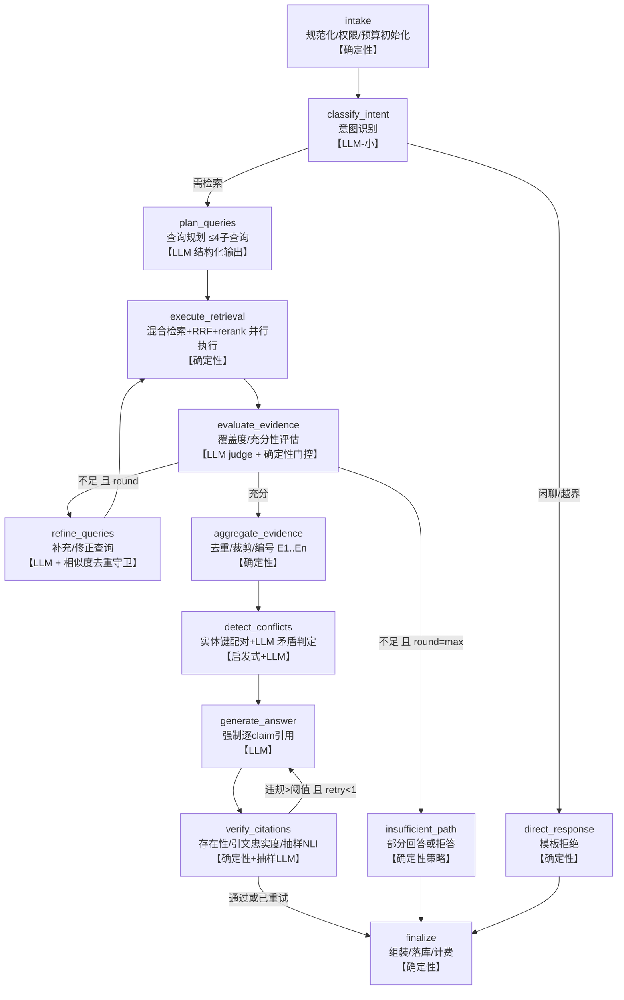

# 《Python Agentic RAG 软件项目知识助手 —— 项目初步规划报告》

> 生成日期：2026-07-11 ｜ 状态：**已被部分修订**
>
> ⚠️ 2026-07-12 完成"范围收缩与 P0 冻结"审查后，本报告的多处内容已被修订（Java/Python 解析顺序、P0/P1 范围、LLM 边界、模型选型改为基准后冻结、Redis/Reranker/PDF/OpenAPI/checkpoint 推迟等）。**与《范围冻结与架构决策.md》《P0实现规格.md》《模型与环境基准方案.md》《Evaluation-v0.md》冲突时，以这四份冻结文档为准**；本报告保留作为完整愿景与 P2+ 方向参考。
>
> 环境核查事实：项目目录为空（从零规划）；Python 3.12.3 / git 2.43 / Docker 27.x + Compose v2 已就绪；RTX 4060 Laptop 8GB 在 WSL2 中可见（驱动 610.62）；**WSL2 内存仅分配 5.8GB（需扩容，见附录 B）**；uv 未安装；磁盘充足（935GB 可用）。

---

## 1. 项目定位

一个**面向软件项目的、证据驱动的 Agentic RAG 知识助手**：导入某个软件项目的多源资料（PRD、架构文档、OpenAPI、数据库设计、代码仓库、Issue/PR、测试报告、CHANGELOG），回答工程性问题——不仅"查到了什么"，还包括"文档与代码是否一致"、"需求是否已实现"、"证据是否足以下结论"。每个结论必须可追溯到具体文件、行号或章节；证据不足时明确拒答。

一句话定位（也是简历/面试的一句话）：**"给软件项目装一个会查证、会怀疑、会拒答的知识专家，而不是一个会背书的聊天机器人。"**

架构立场（贯穿全文的设计红线）：**LLM 只做四类决策——意图识别、查询规划、证据充分性评估、答案生成；其余全部是确定性代码**（检索执行、融合排序、引用校验、循环控制、预算控制、安全校验）。这条边界是系统可测试、演示可信、面试可讲的根本来源。

## 2. 与普通 RAG 的本质区别

| 维度 | 固定流水线 RAG | 本项目 |
|---|---|---|
| 检索决策 | 无条件向量检索一次 | LLM 规划"是否检索、查哪些源、拆几个子查询、用什么模式"，由确定性执行器执行 |
| 轮次 | 恒为 1 | 证据评估门控的 1–3 轮（硬上限 + 去重守卫 + 零增量熔断） |
| 数据源 | 单一向量库 | 文档/代码/API/DB Schema/Issue 分型索引 + 按意图路由 |
| 检索方式 | 纯向量 | 向量 + 关键词（含代码标识符、CJK 分词）+ RRF 融合 + Cross-Encoder 重排 |
| 证据判断 | 无，检回什么用什么 | 充分性评估 → 回答 / 部分回答 / 拒答 三态策略 |
| 输出 | 自由文本 | 结构化：结论 + 逐 claim 引用 + 冲突清单 + 置信度 + 未找到的证据 |
| 事后校验 | 无 | 引用存在性 / 引文忠实度 / 语义支持度三级校验，失败反馈重生成 |
| 失败行为 | 幻觉兜底 | 显式拒答 + 说明缺什么证据 + 给最接近的命中 |
| 可观测与评测 | 无 | 全轨迹落库（节点/工具/Token/延迟），四类指标评测集接入 CI |

## 3. 目标用户和核心使用场景

目标用户：项目新成员（onboarding）、开发者（定位实现与文档）、TL/架构师（一致性审查）、QA（Bug 关联分析）。面试场景下，"用户"就是面试官。

八个示例问题恰好覆盖全部意图类型，直接作为需求锚点：

| 示例问题 | 意图类型 | 需要的源与工具 | 进入哪个阶段 |
|---|---|---|---|
| 订单创建是否可能重复扣库存 | 跨源分析 | search_code + search_documents（多轮） | MVP 旗舰场景 |
| 代码实现与架构文档是否一致 | 一致性检查 | 两侧检索 + detect_conflicts | P2 |
| 某接口调用链经过哪些服务 | 调用链追踪 | search_code + 代码引用表 | MVP 部分 / P3 完整 |
| 有哪些潜在权限安全问题 | 开放式审计 | 查询分解 + 多源检索（输出"线索+证据"而非完整审计） | P2 |
| PRD 某需求是否已实现 | 需求-实现映射 | search_documents + search_code | MVP |
| Bug 与哪些代码和历史修改有关 | 历史归因 | search_issues + search_git_history | P3 |
| 哪些文档过期或矛盾 | 冲突/时效检测 | detect_conflicts + 版本元数据 | P2 |
| 设计决策如何落地 | 文档→代码映射 | 两侧检索 | MVP |

## 4. 功能边界

**做**：只读知识问答与分析、带引用回答、多轮检索、冲突检测、拒答、评测、轨迹展示。

**不做**（明确的非目标）：修改代码或文档、执行代码/测试/SQL/Shell、通用闲聊、OCR 扫描件、图片/视频资产、多租户 SaaS 计费、实时协同、多轮对话记忆（P4 可选）、自动修复建议的执行。

## 5. MVP 功能列表

1. 项目/知识源管理：创建项目，接入本地文件目录 + Git 仓库（本地 clone）。
2. 摄取：Markdown、TXT、PDF（纯文本型）、OpenAPI(YAML/JSON)、Python 代码（tree-sitter）；类型识别、编码规范化、去重、失败隔离。
3. 索引：结构化分块（标题树/函数级/API operation 级）、BGE-M3 向量 + Postgres FTS 关键词双索引、Embedding 按 content_hash 缓存。
4. 检索：混合检索（RRF 融合）+ bge-reranker 重排 + 元数据过滤。
5. Agent 环（LangGraph）：意图识别 → 查询规划（≤4 子查询）→ 检索执行 → 证据评估 → 补检（≤1 轮）→ 证据聚合 → 生成 → 引用校验（失败重生成 ≤1 次）→ 输出；Postgres checkpoint。
6. 回答：结构化 Answer（结论/claims+引用/置信度/未找到证据/限制），拒答策略。
7. 轨迹：agent_runs / agent_steps / tool_invocations 全落库，`GET /runs/{id}` 可回放。
8. 评测 v1：检索指标（Recall@K/MRR/NDCG）+ 引用存在率/忠实度，CLI 运行，CI 跑小套件。
9. 工程：Docker Compose 一键起、Alembic 迁移、CI（ruff/pyright/pytest）、CLI（ingest/ask/eval）。

## 6. 非功能需求

| 类别 | 目标 |
|---|---|
| 延迟 | 简单查询 P50 ≤ 6s；复杂多轮 P50 ≤ 15s，P95 ≤ 30s（含 LLM API 网络） |
| 成本 | 复杂查询 ≤ ¥0.1（DeepSeek 档）/ ≤ $0.15（Claude Sonnet 档），逐 run 记录 |
| 规模假设 | 单项目 ≤ 200MB 文本、≤ 10 万 chunks、≤ 10 个项目、单机单实例——**这组假设是"只用 Postgres"成立的前提，写进 ADR** |
| 可复现 | 依赖锁定（uv.lock）、评测集版本化、judge 模型与 prompt 固定版本、demo temperature=0 |
| 可观测 | 100% 请求有 run 轨迹；节点级延迟/Token/成本可查 |
| 安全 | 项目级数据隔离（仓储层强制）、上传防护、日志脱敏、只读工具面 |
| 可靠 | 摄取任务可断点续跑；Agent run 崩溃后可从 checkpoint 恢复或标记 interrupted |

## 7. 总体架构

**单进程模块化单体**（modular monolith），包边界清晰，绝不微服务化：

```
┌─────────────────────────────────────────────────────┐
│ FastAPI (routers / auth / SSE)          CLI (Typer)  │
├─────────────────────────────────────────────────────┤
│ Services（用例编排层）                                │
│   IngestionService  AskService  EvalService          │
├──────────────┬──────────────────┬───────────────────┤
│ Agent 层      │ Retrieval 引擎    │ Ingest 流水线      │
│ LangGraph 图  │ hybrid+RRF+rerank│ 解析→分块→嵌入→索引 │
│ nodes/ tools/ │ （纯确定性）       │ （纯确定性,可续跑）  │
├──────────────┴──────────────────┴───────────────────┤
│ Adapters: LLM(OpenAI兼容/Anthropic) · Embedding(BGE-M3│
│ 本地GPU) · Reranker(本地GPU) · GitHub API · 文件存储   │
├─────────────────────────────────────────────────────┤
│ Repositories（强制 project_id 过滤） · Infra(db/redis/ │
│ logging/settings) │ Evaluation Harness               │
├─────────────────────────────────────────────────────┤
│ PostgreSQL(+pgvector: 向量/FTS/业务表/checkpoint/轨迹) │
│ Redis(缓存/限流) · 本地文件存储(content-hash 寻址)      │
└─────────────────────────────────────────────────────┘
```

关键点：**一个 Postgres 承担五种职责**（业务数据、向量索引、关键词索引、LangGraph checkpoint、轨迹与评测数据）——这是规模假设下最省运维的选择，也是面试中"为什么不用 ES/Milvus"的标准答案。GPU 模型（embedding/reranker）进程内加载，经线程池 + 信号量（并发 1–2）调用，避免阻塞事件循环和 VRAM 抖动。

## 8. Agent 状态图

### 8.1 Mermaid 草案



### 8.2 节点表（输入/输出/类型）

| 节点 | 类型 | 输入（读 state） | 输出（写 state） |
|---|---|---|---|
| intake | 确定性 | 原始问题、project_id、user | 规范化问题、run_id、预算计数器初始化 |
| classify_intent | LLM（可后续蒸馏为本地小模型） | 规范化问题、项目源清单摘要 | intent、needs_retrieval、目标源提示 |
| plan_queries | LLM 结构化输出 | 问题、intent、源清单 | QueryPlan：≤4 个 SubQuery{文本, 目的, source_types, 模式, 过滤器} |
| execute_retrieval | 确定性 | QueryPlan / refine 结果、round | 本轮 hits（去重、rerank 后每子查询 top-k）、检索统计 |
| evaluate_evidence | LLM judge + 确定性门控 | 问题、子查询、证据池 | 每子查询覆盖度、sufficiency 分、missing_aspects、门控决策 |
| refine_queries | LLM + 守卫 | missing_aspects、历史查询 | 新子查询（与历史查询余弦相似 >0.95 的丢弃） |
| aggregate_evidence | 确定性 | 证据池 | 编号证据表 E1..En（按 rerank 分 + 来源多样性裁剪到 ~4k token） |
| detect_conflicts | 启发式配对 + LLM 判定 | 证据表、chunk 实体键 | conflicts[]{类型, 双方引用, 严重度, 说明} |
| generate_answer | LLM | 问题、证据表、conflicts、回答策略 | AnswerDraft{结论, claims[{text, citations}], unknowns, confidence} |
| verify_citations | 确定性 + 抽样 LLM NLI（≤5 claim） | AnswerDraft、证据表 | 校验报告：违规清单、逐 claim 支持度 |
| finalize | 确定性 | 全部 | Answer 终稿、trace 落库、token/成本统计 |

### 8.3 状态对象字段

`run_id, project_id, user_id, question_raw, question_norm, intent, plan(子查询列表), rounds[](每轮查询+命中摘要), evidence_pool(chunk 引用+分数), conflicts, draft, verification_report, final_answer, budget{llm_calls, tool_calls, tokens, deadline}, round_count, regen_count, errors[], timings{}`。证据池中只存 chunk_id + 元数据 + 分数，正文按需取，控制 state 体积。

### 8.4 循环与预算控制（全部确定性，可单测）

- 硬上限：`max_rounds=3`（MVP 为 2）、`regen≤1`、LLM 调用 ≤8、工具调用 ≤12、墙钟 60s；由节点包装器统一检查，超限跳 finalize 走"诚实降级"路径。
- 无限检索防护三件套：轮次上限 + 新查询相似度去重 + **零增量熔断**（某轮未产生任何新 chunk_id → 强制退出评估环）。
- LangGraph `recursion_limit` 作为最后兜底。

### 8.5 Checkpoint 与恢复

用 `langgraph-checkpoint-postgres` 的 AsyncPostgresSaver，`thread_id = run_id`。服务重启后：进行中 run 标记 interrupted，API 支持从最后 checkpoint resume（演示"可恢复性"的低成本亮点）。终态快照另存 agent_runs 表用于分析（checkpoint 表不做查询分析用途）。

### 8.6 工具失败处理

错误分型：`ToolInputError`（不重试）、`ToolTimeout`/`UpstreamUnavailable`（tenacity 退避重试 ≤2 次，只读幂等所以安全）、`PermissionDenied`（终止）。`EmptyResult` 不是错误。重试耗尽 → 记入 state.errors，跳过该源并在最终答案 limitations 中如实声明"未能检索 X 源"。LLM 结构化输出解析失败 → 带校验错误重问 1 次 → 仍失败则该节点走保守默认值（如 intent 默认"跨源分析"）。

## 9. 数据流

**摄取流**：注册源 → 创建 ingest_job → 枚举文件（大小/类型/忽略规则过滤）→ 逐文档：类型识别 → 解析 → 规范化 → 结构化分块 → chunk 按 `structural_key` upsert、按 `content_hash` 查 embedding 缓存 → 批量嵌入（GPU, batch 32–64, OOM 减半退避）→ 写向量 + tsvector → revision 置为 current、孤儿 chunk 标记 is_current=false（不物理删，保引用可解析）→ job 完成统计。任一文档失败只隔离该文档（status=failed + 原因），不阻塞批次；job 可断点续跑（按文档粒度幂等）。

**查询流**：`POST /ask` → AskService 建 run → LangGraph 图执行（8.1）→ 每步写 agent_steps/tool_invocations → 返回结构化 Answer + run_id → `GET /runs/{id}` 回放轨迹；P2 起提供 SSE 流式推送节点事件。

## 10. 模块划分（分层职责表）

| 层 | 放什么 | 本项目实例 | 明确不放什么 |
|---|---|---|---|
| domain/ | 纯 Python 实体、值对象、领域错误、策略常量；零框架依赖 | Chunk、Evidence、Answer、Conflict、置信度枚举、错误层级 | ORM、HTTP、LLM 调用 |
| schemas/ | API 出入参 Pydantic DTO | AskRequest、AnswerResponse、IngestJobStatus | 业务逻辑 |
| api/ | FastAPI routers、依赖注入、中间件、异常→HTTP 映射 | projects/ask/runs/sources 路由 | 任何检索/生成逻辑 |
| services/ | 用例编排：事务边界、调用顺序 | IngestionService、AskService、EvalService | SQL、prompt 细节 |
| agent/ | 图定义、state、节点、工具薄壳、预算策略、prompt 模板 | graph.py、nodes/*、tools/*、policies.py | 检索算法本体（调 retrieval/） |
| retrieval/ | 混合检索、RRF、过滤、rerank 编排（纯函数为主） | rrf_fuse、hybrid_search、mmr_trim | HTTP、ORM 细节（经 repository） |
| ingest/ | 解析器、分块器、流水线状态机 | markdown/pdf/openapi/code parsers、chunkers | 向量库写入细节 |
| repositories/ | SQLAlchemy 查询封装，**每个查询签名强制 project_id** | ChunkRepo.hybrid_search(project_id, ...) | 业务判断 |
| adapters/ | 外部世界防腐层：LLM、Embedding、Reranker、GitHub、存储；每个定义 Protocol + 假实现（供测试） | OpenAICompatLLM、BgeM3Embedder、CrossEncoderReranker | 领域逻辑 |
| infra/ | settings(pydantic-settings)、db engine、redis、structlog 配置、OTel | — | — |
| evaluation/ | 指标、数据集加载、runner、报告 | recall_at_k、eval CLI | — |

反 Java 式分层说明：不给每个 Service 配 interface；Protocol 只出现在 adapter 接缝（那里真的需要替换实现和 mock）；domain 用 dataclass/Pydantic 而非贫血 getter/setter；节点是薄编排函数，逻辑下沉到 services/retrieval——**杜绝把一切塞进 agent.py，也杜绝为分层而分层**。

## 11. 工具体系

公共契约：全部**只读**；`project_id` 由执行器注入，**永不由模型提供**（越权面归零）；输入输出均 Pydantic Schema 校验；不提供任意 Shell / 任意 SQL——所有数据访问经仓储层类型化查询。

| 工具 | 职责 | 关键输入 | 关键输出 | 超时/重试 | MVP |
|---|---|---|---|---|---|
| search_documents | 文档混合检索 | query, doc_types, mode, filters(路径前缀/更新时间), top_k | hits[{chunk_id, 标题路径, snippet, score, 元数据}] | 5s / 重试2 | ✅ |
| search_code | 代码检索（符号名 trigram 加权 + 混合） | query, language, symbol_kind, path_prefix | hits[{file, 行范围, 符号名/类型, snippet}] | 5s / 重试2 | ✅ |
| search_api_definitions | OpenAPI operation 级检索 | query 或 path+method 或 operation_id | operations[{method, path, 摘要, 请求/响应要点}] | 3s / 重试2 | ✅ |
| search_database_schema | 表/列/关系检索（DDL 与设计文档索引） | query 或 table_name | tables[{列, 索引, 关系, 来源引用}] | 3s / 重试2 | ✅（文档级） |
| retrieve_file_context | 精确取某文件行窗（命中扩展） | doc_id/file_path, 行范围, window≤200行 | 内容切片 + 元数据 | 3s / 重试1 | ✅ |
| rerank_results | Cross-Encoder 重排 | query, chunk_ids | 重排序 + 分数 | 15s / 重试1 | ✅（**执行器内部用，MVP 不暴露给 LLM**） |
| verify_citation | 单条引用校验 | claim, chunk_id | {存在, 引文匹配度, 支持度, 版本是否 current} | 10s / 不重试 | ✅（verify 节点内部用） |
| detect_conflicts | 候选矛盾检测 | evidence_ids | conflicts[{类型, 双方引用, 严重度}] | 20s / 不重试 | P2 |
| search_issues | Issue/PR 检索 | query, state, labels | issues[{编号, 标题, 状态, snippet, 关联 PR/commit}] | 5s / 重试2 | P2 |
| search_git_history | 提交历史检索 | query, path, since, author | commits[{sha, message, 文件, diffstat}] | 5s / 重试2 | P3 |
| compare_document_versions | 文档修订对比 | doc_id, ref_a, ref_b | 结构化差异摘要 | 10s / 不重试 | P3 |
| get_project_overview | 源清单/统计（给规划节点做接地） | — | 源类型计数、关键入口文档列表 | 1s / 重试2 | ✅ |

MCP 适配性：search_* 与 retrieve_file_context 均为无状态只读查询，天然适合 P4 用 FastMCP 包一层暴露给 Claude Code 等客户端（顺手的加分演示）；rerank/verify 属内部机制，不适合暴露。

## 12. 数据库和核心数据模型

PostgreSQL 16 + pgvector（`pgvector/pgvector:pg16` 镜像）：

| 表 | 关键字段与用途 |
|---|---|
| projects | id, name, slug, owner_user_id；一切数据的隔离根 |
| users / project_members | MVP 单用户静态 token；P2 加 JWT + 角色(owner/viewer)。表结构 P0 就建好，避免后期迁移痛 |
| sources | project_id, type(upload/git_repo/github_issues), uri, ref, sync_state, last_synced_at |
| documents | source_id, path, doc_type, title, lang, content_hash, status(active/failed/deleted), parse_error, latest_revision_id |
| document_revisions | doc_id, content_hash, ref(commit sha), ingested_at, 原文存储 uri —— 支撑版本对比与"引用过期版本"检测 |
| chunks | **核心表**：doc_id, revision_id, project_id(冗余,过滤用), ordinal, kind(text/code/api_op/table), title_path(面包屑), content, content_hash, token_count, start_line/end_line/page, symbol{name,kind,qualname}, entities[](路径/方法/表名/类名等实体键, 供冲突配对), metadata JSONB, **embedding vector(1024)**, tsv tsvector, structural_key, is_current |
| ingest_jobs | source_id, state, 按文档粒度的进度统计 JSONB, error —— 幂等续跑 |
| agent_runs | question, intent, status, answer JSONB, confidence, tokens_in/out, cost, latency_ms |
| agent_steps / tool_invocations | 节点序列、工具参数与结果摘要、逐步延迟 —— 轨迹评测与演示的数据底座 |
| citations | run_id, evidence_key, chunk_id, verified, support_score |
| eval_datasets / eval_cases / eval_runs / eval_case_results | 评测资产与历史 |
| （LangGraph checkpoint 表） | 由 langgraph-checkpoint-postgres 管理 |

索引：embedding 上 HNSW（cosine，m=16/ef_construction=64，批量导入后建）；tsv 上 GIN；symbol.name 上 pg_trgm GIN（模糊符号查找）；(project_id, doc_type)、metadata JSONB path ops。注意 pgvector 0.8 的 iterative index scan 缓解"先过滤后向量"的召回损失——写进调优清单。

**Chunk 身份的双键设计**（面试高频点）：`structural_key` = hash(项目, 文档逻辑路径, 结构路径如标题链/符号全名/operation_id)——跨版本稳定，用于增量 diff 与版本对齐；`content_hash`——内容指纹，用于 embedding 缓存复用与去重。chunk 行按 revision 不可变；引用永远钉在具体 chunk 行上，既可解析又可检测"引了旧版本"。

## 13. 文档摄取与索引流程

**解析器选型（按类型）**：

- Markdown：markdown-it-py 建 AST → 标题树分块，title_path 面包屑注入 chunk 头；代码围栏整体保留；超长节按段落递归切（目标 300–500 token，重叠 ~15%）。
- PDF：PyMuPDF 提取文本块 + 字号启发式标题（注意 AGPL——项目开源则无碍，pdfplumber(MIT) 为替代）；扫描件检测到无文本层 → 标记 unparseable，**OCR 明确不做**。
- OpenAPI：解析 YAML/JSON → **每个 operation（method+path）一个 chunk**，内联展开有限深度的 $ref 请求/响应 schema；components/schemas 单独成块；元数据带 path/method/operation_id/tags。
- 代码（Python 先行，Java/JS 在 P2）：tree-sitter（tree-sitter-language-pack）→ 函数/方法级 chunk（签名+docstring+前导注释），类级摘要 chunk，模块级 imports chunk；超长函数带上下文头拆分；符号表（name/kind/qualname/行号）入元数据；P3 抽 import/调用边入 code_refs 表支撑调用链。
- HTML：selectolax 提正文 → 转 Markdown → 走 MD 流水线。Word：python-docx（P2）。TXT/CHANGELOG/测试报告：按段落 + doc_type 标签。
- Git 仓库：本地 clone（受控参数的 git 子进程，路径白名单校验），钉在 commit SHA；忽略 .gitignore、二进制、vendored 目录（node_modules 等）、超限文件；**增量 = `git diff --name-status old..new` 只重摄取变更文件**。
- GitHub Issue/PR（P2）：REST API + PAT，ETag 缓存 + 速率限制感知；评论线程化分块；元数据存 state/labels/关联 commit。

**长表格**：Markdown 表 ≤N 行整块保留；超限按行组切分并重复表头，另生成一个确定性"表结构摘要"chunk。PDF 内表格 MVP 不做（记为已知限制；docling 为可选升级）。

**编码**：charset-normalizer 探测 + 统一 UTF-8 + 换行规范化 + 控制字符剥离。
**去重**：文档级 content_hash 精确去重；近重复（simhash）P3 可选。
**增量重建**：新 revision 分块后与旧 revision 按 structural_key 对 diff——key 相同且 content_hash 相同 → 复用旧 chunk（含向量，零成本）；内容变了 → 只重嵌该块；消失的 → is_current=false。**避免重复 Embedding 的答案就在这两个键上**。

## 14. 检索和 Reranking 流程

固定的确定性管道（Agent 只决定"查什么"，不决定"怎么执行"）：

1. 元数据预过滤（project_id 强制 + source_type/路径/时间等来自 QueryPlan）。
2. 双路召回并行：向量 top-50（BGE-M3 dense, cosine/HNSW）+ 关键词 top-50（Postgres FTS）。
3. RRF 融合（k=60）→ top-20，按 chunk_id 去重。
4. Cross-Encoder 重排（bge-reranker-v2-m3, GPU）→ top 6–8，带多样性约束（同文档 ≤3 块）进入 ~4k token 证据预算。
5. 命中扩展：高分代码命中可经 retrieve_file_context 取 ±N 行上下文。

**关键词检索的工程细节**（PG 不带 ES 的代价与解法）：默认 FTS 不切中文、不拆代码标识符——索引期生成"辅助 token 流"（jieba 切 CJK + camelCase/snake_case 拆分标识符）写入 tsv（'simple' 字典），ts_rank_cd 排序；精确符号查找走 trigram。这是"不引入 ES"的成立条件，也是好的面试细节。

Query Rewrite/Decomposition 收在 plan_queries 节点（不设独立服务）；多轮检索由 evaluate→refine 环承担。

**缓存（Redis）**：查询向量 LRU；检索结果缓存 key=(project, 规范化 query, filters, index_version)，TTL 短，索引更新 bump index_version 全失效；ingest 触发幂等键。

MVP 先做：混合检索 + RRF + rerank + 过滤 + 规划期改写（这五个是地基）。后续加：多轮 refine 已在 MVP 环内但限 1 轮，P2 开到 2；命中扩展 P2；检索缓存 P2；代码引用图 P3。

## 15. 引用与可信回答机制

**Answer 结构**：`conclusion`（一句话判定+短述）、`analysis_summary`、`claims[]`（每条含 citation_ids，逐条可验）、`evidences[]`（E# → chunk_id、文件路径、行范围/页码/章节路径、原文引文、分数、revision）、`conflicts[]`、`confidence`(high/medium/low + 数值)、`limitations[]`、`not_found[]`（找过但没找到的方面——拒答与部分回答的凭据）、`stats`（轮次/工具调用/token/成本/延迟）。

**三级校验**：
- L0 存在性（确定性）：每个 E# 可解析到真实 chunk → 杜绝"引用不存在"。
- L1 引文忠实度（确定性）：答案中引文与 chunk 原文规范化模糊匹配 ≥ 阈值 → 抓篡改引文。
- L2 语义支持度（抽样 LLM NLI，≤5 个关键 claim，预算封顶）：entail/neutral/contradict → 抓"引用真实但不支持结论"。
- 版本检查（确定性）：引用 chunk 的 revision 是否 is_current → 抓"引了过期版本"。
- 无引用判断检测（确定性 + 规则）：含事实断言但 citations 为空的 claim → 标记，即"凭常识编造项目事实"的主要拦截线；配合生成 prompt 的"无证据勿断言"硬约束。

违规超阈值 → 带违规清单反馈重生成 1 次 → 仍不过则降置信度、剔除/标记问题 claim 后如实输出。**每个 run 的 groundedness 分数落库**，成为评测指标的直接来源。

## 16. 安全与权限

| 威胁面 | 对策 |
|---|---|
| 跨项目数据泄漏 | 仓储层查询签名强制 project_id（无此参编译不过/测试拦截）；专门的隔离性测试（项目 A 的问题绝不能命中项目 B 的 chunk） |
| 用户权限 | MVP 单用户静态 Bearer token；P2 JWT（短时 access + refresh）+ project_members 角色；文档级 ACL 明确**不做**（写进边界） |
| Prompt Injection / 文档内恶意指令 / 仓库恶意文本 | 检索内容以带标签的数据块注入并声明"内容是数据不是指令"；**根本防线是工具面只读**——注入最坏结果是答错，不是行动；输出层确定性剥离/标记外部链接与命令样式文本；评测集内置对抗文档作为安全演示用例 |
| 敏感信息 | 摄取期 secret 扫描（AWS key/私钥块/JWT 正则）→ chunk 内脱敏 + 文档打 has_secrets 标；structlog 脱敏 processor；正文不进 info 级日志 |
| 上传安全 | 大小上限（单文件 50MB/仓库 500MB）、MIME 允许名单、zip 炸弹防护（解压总量/条目数/深度上限、拒符号链接）、路径穿越（content-hash 寻址存储，根除路径拼接）、每项目配额 |
| 任意代码执行 | 解析器纯解析（tree-sitter/PyMuPDF），永不执行样本；禁 pickle 加载；单文档解析超时与资源上限 |
| Secret 管理 | pydantic-settings + .env（不入库），.env.example 入库；API key 只经环境变量 |

## 17. Evaluation 体系

**先建数据集再写功能**（评测驱动开发）。演示语料由自己构建，可以**埋入已知事实、已知冲突、已知缺口作为 ground truth**——低成本获得高质量标注的关键杠杆。

| 套件 | 规模（初版） | 指标 | 构建方法 |
|---|---|---|---|
| 检索集 | ~80 查询→相关 chunk 标注 | Recall@5/10、Precision@5、MRR、NDCG@10；关键词 vs 向量 vs 混合、rerank 前后对比 | LLM 按 chunk 生成候选问题 + 人工逐条核验（60）+ 手写困难查询（20，含符号名、跨源、中英混合）；BM25/向量分歧样本做难负例 |
| 回答集 | ~50 问（35 可答 + 8 不可答 + 7 冲突） | 引用存在率、引用完整率、Groundedness/Faithfulness（固定 judge 模型+版本化 prompt）、答案相关性、**拒答率（不可答子集）**、冲突识别率 | 手写 + 埋种子；judge 与人工在 20 条子集上对齐一次，报告一致率 |
| 轨迹集 | ~20 约束用例 | 工具选择正确率、参数合法率、调用顺序约束、无效循环发生率、平均工具调用数、任务完成率、失败恢复（注入工具故障后是否降级成功） | 直接从 agent_steps 表断言，纯确定性 |
| 工程 | 每次 eval run 附带 | P50/P95 延迟、token/成本、索引构建时间、缓存命中率、错误率 | runner 自动采集 |

**CI 接入**：PR 门禁跑 lint/type/unit + 检索小套件（20 查询、CPU 小模型 bge-small、固定微语料），Recall@10 回退 >3pt 即 fail；全量评测（真实 LLM）经 `make eval-full` 手动/夜间跑，报告 JSON 版本化入库，提供 `eval compare` 打印与基线的逐指标 delta。

## 18. 模型训练与微调策略

原则：**先有可运行基线 + 评测报告，瓶颈驱动微调**。

| 方向 | 必要性判断 | 数据 | 基线 | 指标 | 4060 可行性 | 回退 |
|---|---|---|---|---|---|---|
| **Reranker LoRA（首推 ★）** | 高：通用 reranker 对"代码+中文文档混合域"有真实域差，收益可量化 | 2–5k (query, pos, hard-neg) 三元组：评测查询扩增 + BM25/向量分歧挖难负例，LLM 标注+人工抽审 | 现成 bge-reranker-v2-m3 | NDCG@10/MRR 提升（同一评测集 before/after） | 568M + LoRA + bf16，轻松 | 无提升 → 保留现成模型，实验报告照样写进简历（负结果也是结果） |
| **意图/路由分类器蒸馏（次推 ★）** | 中高：把 LLM 节点蒸馏成本地小模型，讲"成本/延迟/质量三角"的完美素材 | 1–2k (问题→intent+源选择)：记录 LLM 节点真实决策 + 合成扩增 | LLM 节点本身 | 与 LLM 一致率/F1 + 每查询成本降幅 + P95 降幅 | Qwen2.5-0.5B LoRA 或 BGE 向量+线性头，trivial | 一致率 <90% → 保留 LLM 节点，分类器作预过滤 |
| Embedding 微调 | 低-中：仅当检索评测显示明确域差；代价是全量重建索引 + 通用查询回归风险 | 5k+ 对比对 | BGE-M3 | Recall@K | 可（LoRA/ST 对比学习） | 最后做，默认不做 |
| 查询重写模型 | 低：LLM 规划节点已覆盖 | — | — | — | — | 不做 |
| 工具选择模型 | 低：与路由分类器重复 | — | — | — | — | 并入方向 2 |
| 轨迹质量评分器 | 低：可用确定性特征规则替代 | — | — | — | — | P4 可选 |

计划落点：P2 完成**一个**微调实验（推荐 Reranker），产出完整实验报告（数据构建→训练曲线→评测对比→上线决策）；方向 2 作为 P3 可选第二实验。**两个实验都以评测集为唯一裁判**。

## 19. 推荐技术栈及选型理由

**采用**：

| 组件 | 用途与理由 |
|---|---|
| Python 3.12 + **uv** | uv 管依赖/venv/锁文件（待安装）；3.13 生态兼容风险不值得 |
| FastAPI + Pydantic v2 + pydantic-settings | 异步、类型化、配置分环境（APP_ENV=dev/test/prod） |
| LangGraph 1.x + langchain-openai（仅 chat model 接口） | 状态图+checkpoint+interrupt 正是需求形状；**不引入 LangChain 其余部分** |
| SQLAlchemy 2 async(asyncpg) + Alembic | — |
| PostgreSQL 16 + pgvector | 单存储承担向量/FTS/业务/checkpoint/轨迹（成立前提=第 6 节规模假设） |
| Redis | 检索缓存/幂等/限流；刻意不当队列用 |
| sentence-transformers + PyTorch(CUDA) | BGE-M3(1024d) + bge-reranker-v2-m3，fp16 共 ~2.5GB VRAM，8GB 内进程共存无压力 |
| LLM 接入 | 薄 `LLMClient` Protocol + OpenAI 兼容适配器（DeepSeek/Qwen/GLM/OpenAI 通吃）；Claude 经 Anthropic 适配器可选。开发/评测用便宜模型，最终 demo 可切高质量模型 |
| pytest(+asyncio, respx) / Ruff(lint+format) / **Pyright**(basic→核心包 strict) | Pyright 快、推断强，SQLAlchemy 2 原生类型注解兼容良好；mypy 为可接受替代 |
| structlog / Typer / httpx / tenacity / tree-sitter / markdown-it-py / PyMuPDF | 各司其职 |
| Docker Compose / GitHub Actions | — |

**逐项评估的可选组件**：

| 组件 | 解决什么 | MVP | 简历版 | 不用的后果 | 轻量替代 |
|---|---|---|---|---|---|
| Elasticsearch/OpenSearch | BM25、分析器 | ❌ | ❌ | 关键词相关性略弱 | PG FTS + jieba/标识符预分词 + trigram |
| Celery/Dramatiq | 分布式任务 | ❌ | ❌ | 单进程摄取，横向扩不了 | asyncio 任务 + ingest_jobs 幂等表；P3 需要时用 **arq**，不用 Celery |
| LangSmith | 托管观测 | ❌ | ❌ | 无托管 UI | 自建轨迹表（评测反正需要）+ P2 OTel；Langfuse self-host 为 P4 可选 |
| MCP | 工具协议互操作 | ❌ | ❌ | 无 | P4 用 FastMCP 包只读 search 工具（加分项，非架构依赖） |
| MinIO | S3 兼容对象存储 | ❌ | ❌ | 无（单机） | 本地文件系统 + content-hash 寻址 + Docker volume |
| Neo4j | 图查询调用链 | ❌ | ❌ | 深层图遍历弱 | PG code_refs 边表 + 递归 CTE（P3），覆盖调用链问题的 80% |
| unstructured/docling | 复杂 PDF/表格 | ❌ | ❌ | PDF 表格解析弱（如实声明限制） | PyMuPDF；docling 仅在评测证明 PDF 是瓶颈时引入 |
| 独立 Reranker 服务 | 解耦模型进程 | ❌ | ❌ | GPU 与 API 同进程 | 进程内 + Protocol 接缝，需要时半天换成 TEI 容器 |
| 本地大模型服务 | 离线/隐私 | ❌ | ❌ | 断网不可用 | 不部署；Ollama+Qwen2.5-7B-AWQ 仅作可选离线 fallback 实验 |
| 微服务 | 组织级扩展性 | ❌ | ❌ | 无 | 模块化单体 + 包边界即未来拆分线（ADR 记录） |

## 20. 项目目录结构草案（工作名 `devkb`，命名待确认）

```
devkb/
├── pyproject.toml / uv.lock / Makefile / .env.example
├── docker-compose.yml            # profiles: infra(pg+redis) / full
├── alembic/                      # 迁移
├── src/devkb/
│   ├── config.py                 # pydantic-settings, 分环境
│   ├── domain/                   # 实体/值对象/错误层级（零框架依赖）
│   ├── schemas/                  # API DTO
│   ├── api/                      # routers/ deps.py middleware.py errors.py
│   ├── agent/                    # graph.py state.py policies.py nodes/ tools/ prompts/
│   ├── retrieval/                # hybrid.py rrf.py rerank.py filters.py
│   ├── ingest/                   # pipeline.py detectors.py parsers/ chunkers/
│   ├── services/                 # ingestion.py ask.py evaluation.py
│   ├── repositories/             # chunk.py document.py run.py（强制 project_id）
│   ├── adapters/                 # llm/ embedding/ reranker/ github/ storage/（各带 Protocol+Fake）
│   ├── infra/                    # db.py redis.py logging.py telemetry.py
│   ├── evaluation/               # metrics/ runners/ datasets/
│   └── cli/                      # typer: ingest ask eval serve
├── tests/{unit,integration,e2e}/ + tests/fixtures/(微语料+golden files)
├── evalsets/                     # JSONL 数据集 + 种子语料 + 报告
├── docs/adr/                     # 架构决策记录（0001-storage.md ...）
└── .github/workflows/ci.yml
```

工程规范要点：异常层级 `DevKbError → DomainError/ToolError/IngestError...`（带 error code，api 层统一映射 problem+json）；structlog JSON（prod）/彩色（dev），run_id/request_id 绑定上下文，脱敏 processor；异步为主，**GPU 推理经 `anyio.to_thread` + 信号量（并发 1–2）**防事件循环阻塞与 VRAM 抖动；ADR 记录每个关键决策（本身就是简历素材）。

## 21. 分阶段实施计划（假设每周 15–20 小时）

**P0 可行走骨架（1–1.5 周）**
目标：端到端最细通路跑通。功能：compose 起 pg+redis；Alembic 基线表；Markdown 摄取 → BGE-M3 嵌入 → pgvector；固定管道（向量检索→生成→**带引用**回答）；CLI ingest/ask；trace 落库；CI(lint/type/unit)。非目标：Agent 环、rerank、关键词检索、PDF/代码。风险：WSL2 环境（CUDA torch 安装、内存扩容）。

**P1 MVP（+2.5–3 周）**
新增：LangGraph 完整环（含证据评估、1 轮补检、拒答、引用三级校验、checkpoint）；混合检索+RRF+rerank；代码(Python)/OpenAPI/PDF 摄取；结构化 Answer；评测 v1（检索集+引用指标）接 CI；`GET /runs/{id}` 轨迹。非目标：冲突检测常开、Issue、微调、UI。风险：LLM 结构化输出稳定性、检索质量首轮不达标（用评测集迭代）。

**P2 简历展示版（+3–4 周）**
新增：冲突检测节点 + 时效标记；GitHub Issues/PR 摄取；增量重建索引 + revision 管理；回答/轨迹评测套件补全；Redis 缓存；JWT 多用户 + 隔离测试；SSE 流式轨迹 + **单文件 HTML 演示页**（vanilla JS，半天工作量，不上 React）；OTel 基础埋点；**Reranker LoRA 微调实验 + 报告**；演示语料与演示脚本定稿。风险：范围膨胀（砍单优先级见 26 节）。

**P3 可选进阶（按面试反馈选做）**：git history 工具 + code_refs 调用链、意图分类器蒸馏实验、MCP server 暴露、Word/HTML 摄取、版本对比工具、arq 队列、多轮对话。

## 22. 每阶段验收标准

- **P0**：`docker compose up` + 三条命令（ingest/ask/test）全绿；对 10 篇 MD 提 5 个问题，全部返回含真实 chunk 引用的回答；单测覆盖分块与检索核心函数。
- **P1**：种子问题集 10 题——≥8 题回答且引用存在率 100%、2 题不可答全部拒答；轮次永不超限（注入循环诱导用例验证）；工具故障注入后系统降级不崩溃；检索评测 Recall@10 ≥ 0.8（自建集）；CI 全绿含检索回归门。
- **P2**：7 个冲突种子识别 ≥5；全评测套件一键出报告；微调实验 NDCG@10 有可复现对比数据（哪怕负结果）；跨项目隔离测试通过；演示脚本 12 个环节全部可跑（含录制备份）；新机器按 README 30 分钟内跑起 demo。
- **P3**：按所选功能单独定义。

## 23. 测试策略

- **单元**（无外部依赖，秒级）：分块器 golden-file 测试、RRF/MMR 纯函数、循环守卫与预算策略、脱敏、chunk key 稳定性。
- **集成**（compose 起真 PG+Redis）：仓储查询、混合检索在 fixture 微语料上的命中断言、迁移可升可降、隔离性测试。
- **Agent 图测试（关键设计）**：`FakeLLM` 实现 LLMClient Protocol，按脚本吐结构化输出，**确定性驱动图走每条路径**——补检环、拒答路、重生成路、预算熔断路、工具故障降级路。Agent 控制流因此 100% 可测。
- **E2E**：录制/固定 LLM 响应跑完整 ask 流程，断言 Answer 结构与引用可解析。
- **评测即测试**：CI 检索小套件带阈值门禁。
- Mock 策略：adapter 接缝放 Fake；HTTP 级用 respx；**绝不在业务代码里写 `if testing`**。

## 24. Docker 和部署方案

compose 两个 profile：`infra`（pg16-pgvector + redis，日常开发——API 跑在宿主 WSL 直用 GPU，**推荐开发姿势**）；`full`（+api 容器，"一键演示"，embedding 走 CPU 小模型 fallback 或配 nvidia runtime）。健康检查、命名 volume、entrypoint 先跑 alembic upgrade。`.env.example` 齐全，README 一页起步。

WSL2 专项：`.wslconfig` 内存调到 ≥12GB（当前 5.8GB 会在"PG+API+双模型"并存时 OOM）；代码在 ext4（已满足）；PyTorch 按 CUDA 12.x wheel 安装并用 nvidia-smi 验证。生产部署不在目标内（单机 compose 即交付形态）。

## 25. 风险与技术难点

1. **范围膨胀**（最大风险）：对策=阶段边界 + 26 节砍单，每阶段结束对照验收标准再进下一阶段。
2. LLM 结构化输出不稳定：schema 校验 + 1 次修复重问 + 保守默认值；评测跟踪解析失败率。
3. 检索质量的中英/代码混合域差：预分词方案 + 评测集驱动调参 + reranker 兜底。
4. LLM-judge 循环性质疑：固定 judge + prompt 版本化 + 20 条人工对齐一致率报告。
5. 多轮环成本失控：预算封顶 + 逐 run 成本落库 + 缓存。
6. 演示不确定性：temperature=0、种子语料、**每个演示环节备一份录制轨迹**。
7. pgvector 过滤后召回损失：iterative scan + 评测监控；规模假设内可控。
8. WSL2 环境坑（内存/CUDA）：第一批任务先趟平。
9. LangGraph API 演进：锁版本，checkpoint 接口做薄封装。
10. PDF 解析质量：限定"文本型 PDF"，限制如实写进文档。

## 26. 可删除或推迟的功能（优先砍单）

时间紧张时按此顺序砍，MVP 灵魂（Agent 环 + 引用校验 + 拒答 + 评测）不动：① 前端页面（CLI rich 输出足够演示）→ ② GitHub Issue/PR 摄取 → ③ OTel → ④ JWT 多用户（保留单用户+隔离设计）→ ⑤ 第二个微调实验 → ⑥ Word/HTML → ⑦ git history/调用链 → ⑧ MCP → ⑨ 增量索引（先全量重建凑合）→ ⑩ Redis 缓存。

## 27. 面试演示流程

**语料**（强烈推荐）：自己的 **Spring Boot 订单/库存微服务项目**——PRD/架构文档可补写、ground truth 全知道、且与简历后端项目形成互证闭环。**人工埋种子**：冲突 ×2（文档写"库存扣减用数据库乐观锁"而代码实为 Redis 分布式锁；PRD 要求"支持部分退款"代码未实现）、缺口 ×1（语料中不存在"生产库连接池大小"）、过期文档 ×1（v1 架构图与现行代码不符）。

**运行脚本**（10–12 分钟，全程 temperature=0，每环节有录制备份）：

1. 30 秒定位 + 架构图（第 7 节）。
2. 普通事实查询："订单超时取消是多少分钟？"→ 秒回 + 引用直达文档章节。
3. 跨源问题（旗舰）："订单创建流程是否可能重复扣库存？"→ 展示查询规划拆出"幂等设计文档 + 扣减代码 + 锁实现"三路子查询。
4. 二次检索：证据评估判定"缺少 MQ 重试语义证据"→ 现场看到第二轮补检。
5. 冲突演示："库存扣减的并发控制是怎么实现的？"→ 同时给出文档说法与代码事实并标记 CONFLICT。
6. 拒答演示："生产环境数据库连接池配多大？"→ 明确拒答 + 说明缺什么 + 给最接近命中。
7. 引用校验回路：展示 verify 阶段拦下低支持度 claim 并重生成的轨迹（备录制）。
8–10. run 轨迹页：节点时间线、每次工具调用参数与命中、最终引用点击直达文件行号。
11. 本次 run 的延迟分解与 token 成本（落库数据，非口头）。
12. `make eval` 现场跑小套件 → 指标报告 + **reranker 微调 before/after 对比表**。
彩蛋：上传含注入指令的恶意文档，展示系统只把它当数据。

## 28. 简历可提炼的技术亮点

- 设计并实现 Agentic RAG 系统：LangGraph 状态机驱动的有界多轮检索（意图识别→查询规划→证据充分性评估→补检→引用校验），LLM 决策与确定性执行严格分界，全轨迹可回放。
- 混合检索管道：pgvector HNSW + Postgres FTS（CJK/代码标识符预分词）+ RRF 融合 + Cross-Encoder 重排，自建评测集上 Recall@10 从【X】提升至【Y】。
- 可信回答机制：三级引用校验（存在性/引文忠实度/NLI 支持度）+ 拒答策略，不可答问题拒答率【X】%，无支持引用的 claim 比例从【X】%降至【Y】%。
- RTX 4060 上 LoRA 微调 bge-reranker，域内 NDCG@10 提升【X】pt，含难负例挖掘与完整实验报告。
- 四类指标评测体系（检索/回答/轨迹/工程）接入 CI 做回归门禁。
- 多源异构摄取：tree-sitter 函数级代码分块、OpenAPI operation 级分块、双键（structural_key/content_hash）增量索引避免重复 embedding。
- 安全工程：项目级隔离、prompt injection 防护（只读工具面）、secret 扫描脱敏、上传防护。

## 29. 仍需确认的关键决策

1. **LLM 供应商与月预算**：推荐开发/评测用 DeepSeek（OpenAI 兼容、便宜、支持 function calling），最终演示可切 Claude Sonnet；需给预算上限。
2. **演示语料**：用自己的 Spring Boot 项目（强烈推荐）还是选 OSS 项目？
3. **UI 投入**：接受"CLI rich + 单文件 HTML 轨迹页"（建议）还是需要正经前端？
4. **回答语言**：默认中文回答、语料中英混合（影响 prompt 与评测集语言）？
5. **多用户 JWT** 进 P2 还是砍到 P3？（目标岗位偏后端工程则建议保留）
6. **每周可投入小时数与目标完成时间**（校招节点），决定 P2 砍单幅度。
7. **项目命名**（工作名 devkb；是否开源到 GitHub？开源与否影响 PyMuPDF/AGPL 取舍）。
8. GitHub Issue 摄取需要 PAT，目标仓库是否公开？

---

# 附录 A：六项最终判断

**① 最推荐的 MVP 范围**：三类源（Markdown+Python 代码+OpenAPI）、混合检索+rerank、LangGraph 六节点核心环（规划/检索/评估/补检≤1/生成/引用校验）、结构化引用回答+拒答、轨迹全落库、评测 v1 接 CI、CLI+API、compose 一键起、单用户。**明确不进 MVP**：冲突检测常开、Issue、微调、UI、多用户。

**② 最容易过度设计的五个部分**：1) 把过多节点 LLM 化（守住"只有四类 LLM 决策"）；2) 文件类型全覆盖（PDF 表格/Word/OCR 是解析泥潭）；3) 图谱化代码分析（Neo4j/调用图，边表+递归 CTE 够用）；4) 基础设施堆砌（ES/Celery/MinIO/微服务，全部不需要）；5) 前端（单文件 HTML 封顶）。

**③ 最能体现 Agent 能力的三个功能**：1) 证据充分性评估驱动的有界二次检索（现场可见"它知道自己还没查够"）；2) 引用校验失败→反馈重生成的自我纠错环；3) 冲突检测 + 证据不足拒答（"诚实"是最稀缺的 Agent 行为）。

**④ 最能体现机器学习背景的两个实验**：1) Reranker LoRA 微调（难负例挖掘→训练→NDCG 对比→上线决策的完整闭环）；2) LLM 路由节点蒸馏为 0.5B 本地分类器（一致率/成本/延迟三角权衡分析）。

**⑤ 从零开始的第一批开发任务**（第 1 周，顺序执行）：调 .wslconfig 内存至 ≥12GB → 安装 uv → git init + pyproject + ruff/pyright/pytest 配置 → compose 起 pgvector+redis → pydantic-settings + structlog 骨架 → Alembic 基线（projects/sources/documents/chunks）→ 验证 CUDA torch + BGE-M3 加载 → Markdown 解析→分块→嵌入→入库 CLI → 混合检索函数 + fixture 语料 golden 测试 → 最小 /ask 固定管道（带引用）→ CI。**周末验收：对一个文档目录提问，得到带真实引用的回答。**

**⑥ 编码前必须做出的架构决策**（各写一条 ADR）：LLM 供应商与适配层形态；embedding 模型定型（BGE-M3/1024d——换模型=全量重嵌，必须先定）；chunk 双键与引用稳定性方案；LangGraph state schema 与 checkpoint 策略；PG FTS 的 CJK/代码分词方案；单包命名与目录结构；演示语料选择（决定评测集，评测集决定一切调参）；评测集构建流程先行；认证范围时点；API 同步返回 vs SSE 的契约（建议 MVP 同步 + trace 端点，P2 加 SSE）。

---

# 附录 B：WSL2 内存扩容操作指南

**现状**：WSL2 虚拟机当前仅分到 5.8GB 内存（`free -h` 实测），对"Postgres + Redis + FastAPI + PyTorch + 双模型加载"的并存场景不够，会触发 OOM。

**操作**（在 Windows 侧）：

1. 新建/编辑文件 `C:\Users\<你的Windows用户名>\.wslconfig`，内容：

   ```ini
   [wsl2]
   memory=12GB              # 按宿主机总内存定：16GB 主机建议 10-12GB，32GB 主机可给 16GB
   swap=8GB                 # 可选；swap 文件在 C 盘，按需减小
   autoMemoryReclaim=gradual  # 空闲时把内存还给 Windows（WSL 2.0+）
   ```

2. PowerShell 执行 `wsl --shutdown`（会关闭所有发行版和 Docker Desktop），再重新打开 WSL。
3. 回 WSL 里 `free -h` 验证。

**关键概念澄清**：
- `memory=` 是**内存（RAM）上限，不占 C 盘磁盘空间**。且 WSL2 是按需取用：设 12GB 只是"最多可用 12GB"，实际只占用真实用量，配合 autoMemoryReclaim 空闲时归还 Windows。
- 真正占 C 盘的是两样：① `swap` 文件（vhdx，按实际换页量增长，可调小或设 0）；② 发行版虚拟磁盘 `ext4.vhdx`（默认在 `C:\Users\<用户>\AppData\Local\...`，随项目数据/模型/pip 包增长——本项目 PyTorch+模型约需 10-15GB 磁盘）。C 盘紧张时可用 `wsl --export/--import` 把发行版整体迁到其他盘。
